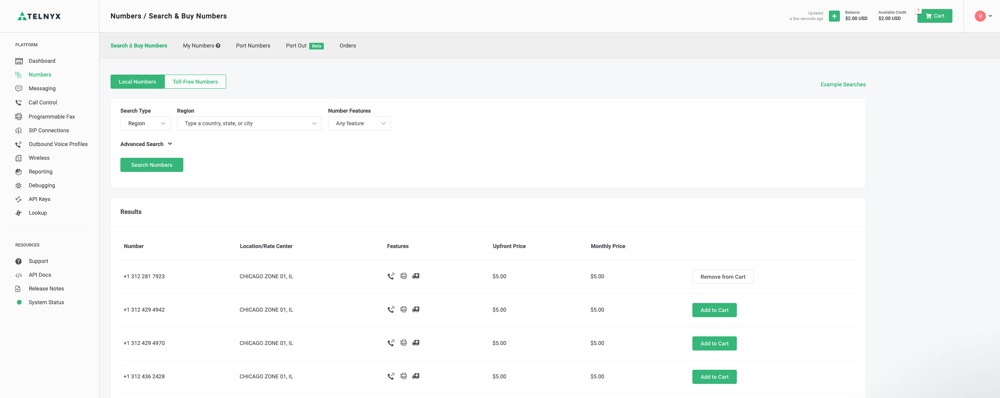
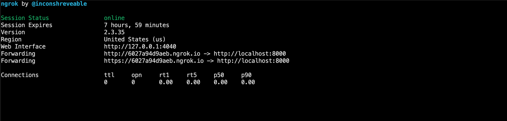
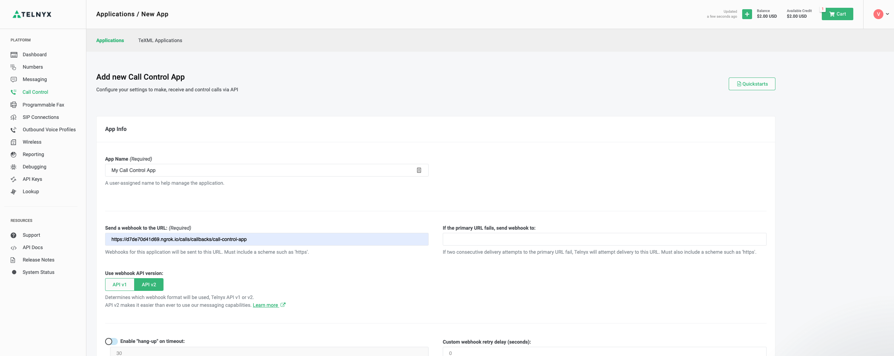
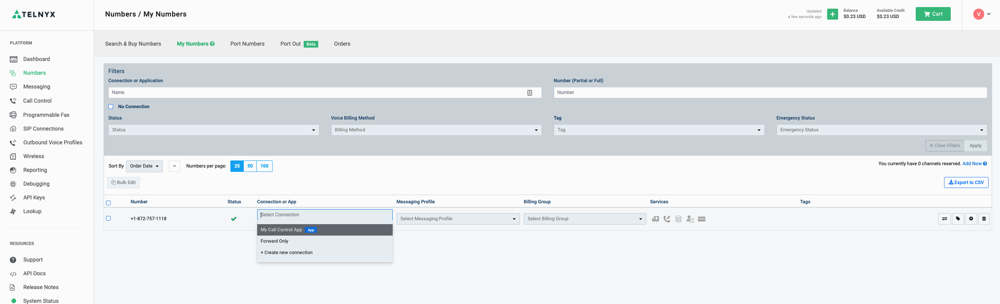
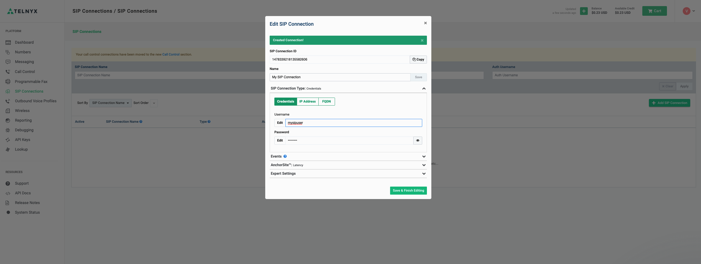
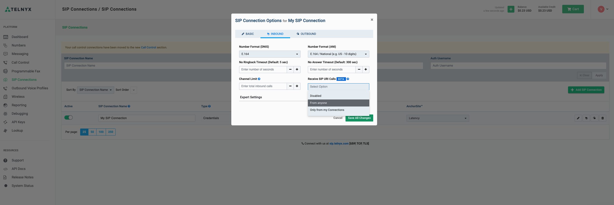
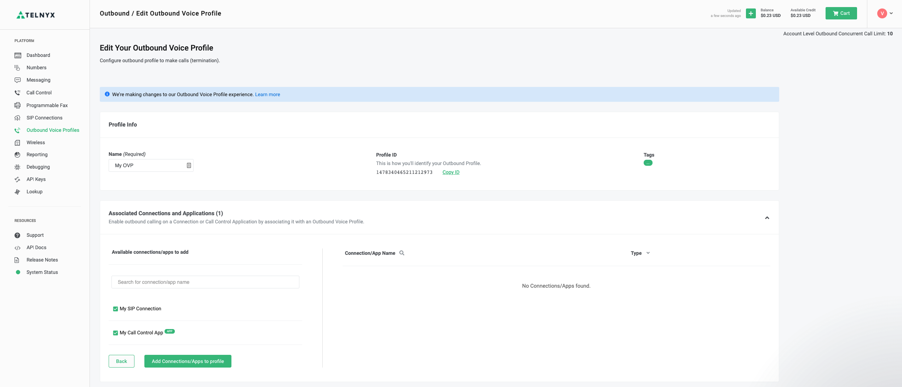

# Call Center App

This is an example of a call center app that uses the Telnyx Client and Call Control SDKs. You can make and receive phone calls in the browser, create call conferences, and manage call center agents.

## Quick start

In this guide, you’ll learn how to get started with the Call Center App by using Telnyx SDKs and the Telnyx Portal. Just follow these steps:

1. Sign up for a Telnyx Account
2. Buy a phone number
3. Install Ngrok
4. Create a Call Control App
5. Update your phone number
6. Create a SIP Connection
7. Create an Outbound Voice Profile
8. Write some code
9. Run the code

---
## Step 1: Sign Up for a Telnyx Mission Control Portal Account

Head to [telnyx.com/sign-up](https://telnyx.com/sign-up) to sign up for your free Telnyx account.\
It’ll give you access to our Mission Control Portal where you can buy phone numbers, set up and manage Call Control Applications, and more.

---
## Step 2: Buy a phone number  

Access Telnyx Mission Control and [buy a phone number](https://portal.telnyx.com/#/app/numbers/search-numbers).\
This is your Call Center phone number that end users will call to reach your application.

---
## Step 3: Install Ngrok

Download and install [ngrok](https://ngrok.com/).\
Start up ngrok with `ngrok http 8000` and make note of the https `Forwarding` URL.\
You will need it to be able to receive websocket requests from the Call Control App 

---
## Step 4: Create a Call Control App

Create a [Call Control App](https://portal.telnyx.com/#/app/call-control/applications/new).\
Set the required webhook URL to `https://your-ngrok-forwarding-id.ngrok.io/calls/callbacks/call-control-app`.\
Make note of the ID of your new Call Control App.

---
## Step 5: Update your phone number

[Update your phone number](https://portal.telnyx.com/#/app/numbers/my-numbers) by selecting your Call Control App under "Connection or App" column.

---
## Step 6: Create a SIP connection

[Create a SIP connection](https://portal.telnyx.com/#/app/connections), setting the "SIP Connection Type" to `Credentials`.

Enable "Receive SIP URI Calls" in the "Inbound" tab.
Make note of your SIP Connection ID.

---
## Step 7: Create an Outbound Voice Profile

[Create an Outbound Voice Profile](https://portal.telnyx.com/#/app/outbound-profiles/new), associating it with your Call Control App and your SIP connection.
Make note of the Outbound Voice Profile ID.

---
## Step 8: Write some code

1. (call-center) Run the command `npm run setup` to generate your `.env` file.
2. (server) Update your `.env` file with information noted from previous steps.

---
## Step 9: Run the code

1. Run `npm install` from the `call-center` folder 
2. Run `npm start`\
This will install and start both the server and web apps.\
This will start an Express app on port specified as the `TELNYX_SERVER_APP_PORT` environment variable (defaults to `8000`).
3. Log in as a call center agent in the browser. Open the ngrok Web Interface (ex: <http://127.0.0.1:4040/inspect/http>) in a separate tab. You should see `/login` request.
4. Call your Call Center phone number from your personal device or a web dialer. You should see requests to `POST /calls/callbacks/call-control-app` come through.

---
## Demo web dialer configuration

You can use the [Telnyx RTC Web Dialer Demo](https://webrtc.telnyx.com/rtc/index.html) to test inbound calls to the call center app.

1. Use token returned from `POST /agents/login` as the "Login Token" to authenticate the web dialer
2. Set "Caller ID Number" to your Call Center phone number.

---
## Follow-ups & Next Steps

 [Call Control Docs](https://developers.telnyx.com/docs/v2/call-control)\
 [Telnyx WebRTC Docs](https://developers.telnyx.com/docs/v2/webrtc)\
 [Telnyx WebRTC Repository](https://github.com/team-telnyx/webrtc/blob/master/packages/js/README.md)\
 [Ngrok Tutorial](https://developers.telnyx.com/docs/v2/development/ngrok)
